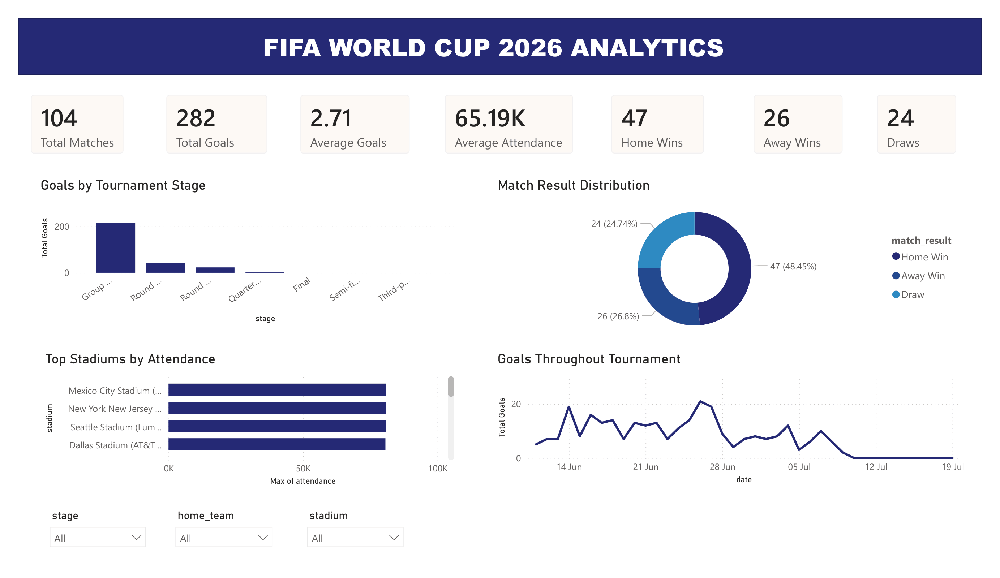
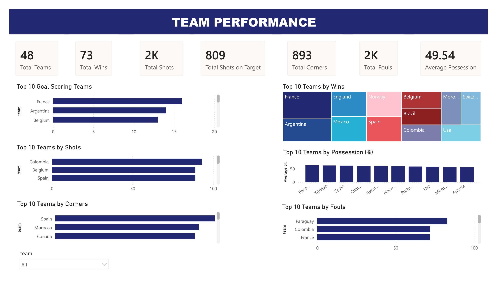

# ⚽ FIFA World Cup 2026 Analytics Dashboard

An end-to-end **Data Analytics** project that analyzes FIFA World Cup 2026 match data using **Python**, **MySQL**, and **Power BI**. The project follows a complete analytics workflow, beginning with raw datasets, followed by data cleaning, exploratory data analysis (EDA), feature engineering, SQL analysis, and finally the development of an interactive Power BI dashboard for tournament and team performance analysis.

---

## 📌 Project Overview

The FIFA World Cup is one of the largest sporting events in the world, generating enormous amounts of match statistics. This project transforms raw tournament data into meaningful insights through a structured data analytics pipeline.

Instead of directly visualizing the raw dataset, the project first processes and enriches the data using Python. New analytical features are created, SQL is used to answer business questions, and Power BI is used to build interactive dashboards for tournament-level and team-level analysis.

The project demonstrates the complete workflow followed by a Data Analyst, from raw data preparation to dashboard development.

---

## 🎯 Project Objectives

- Collect and organize FIFA World Cup 2026 datasets.
- Clean and preprocess raw match data.
- Perform Exploratory Data Analysis (EDA) using Python.
- Engineer new analytical features for deeper insights.
- Generate team-level statistics from match-level data.
- Perform business analysis using MySQL.
- Develop an interactive Power BI dashboard.
- Generate meaningful insights into tournament and team performance.

---

# 🛠️ Tools & Technologies

### Programming & Analysis

- Python
- Pandas
- NumPy
- Matplotlib

### Database

- MySQL

### Visualization

- Microsoft Power BI

---

# 📂 Project Structure

```text
FIFA-World-Cup-2026-Analytics
│
├── data
│   │
│   ├── raw
│   │      ├── matchess.xlsx
│   │      ├── teams.csv
│   │      └── match_stats.csv
│   │
│   └── cleaned
│          ├── matches_cleaned.xlsx
│          ├── matches_featured.xlsx
│          ├── matches_featured.csv
│          ├── teams_cleaned.csv
│          ├── match_stats_cleaned.csv
│          └── team_stats.xlsx
│
├── scripts
│      ├── data_cleaning.py
│      ├── eda.py
│      ├── feature_engineering.py
│      └── team_stats.py
│
├── sql
│      └── sql_analysis.sql
│
├── dashboards
│      └── fifa-world-cup-2026-analytics.pbix
│
├── images
│      ├── overview_dashboard.png
│      └── team_performance_dashboard.png
│
└── README.md
```

---

# 🌍 Project Workflow

The project was completed following the standard Data Analytics workflow shown below.

```
Raw FIFA Datasets
        │
        ▼
Data Cleaning (Python)
        │
        ▼
Exploratory Data Analysis
        │
        ▼
Feature Engineering
        │
        ▼
Generate Team Statistics
        │
        ▼
SQL Analysis (MySQL)
        │
        ▼
Power BI Dashboard
        │
        ▼
Interactive Business Insights
```

# 📥 Step 1 – Data Collection

The project began by collecting FIFA World Cup 2026 data from publicly available football statistics websites, including ESPN and other trusted sources.

The collected raw datasets include:

- `matchess.xlsx`
- `teams.csv`
- `match_stats.csv`

These raw datasets were then cleaned and transformed using Python for further analysis.

---

# 🧹 Step 2 – Data Cleaning

The raw FIFA World Cup datasets were imported into Python and cleaned using **Pandas**.

The cleaning process included:

- Dataset inspection
- Missing value analysis
- Duplicate record removal
- Standardizing column names
- Cleaning text data
- Formatting data types

The cleaned datasets were exported as:

- matches_cleaned.xlsx
- teams_cleaned.csv
- match_stats_cleaned.csv

---

# 📊 Step 3 – Exploratory Data Analysis (EDA)

Exploratory Data Analysis was performed to understand the tournament data before visualization.

The analysis included:

- Tournament KPIs
- Match Result Distribution
- Tournament Stage Analysis
- Highest Scoring Matches
- Biggest Victories
- Average Goals by Stage
- Average Shots by Stage
- Correlation Analysis
- Stadium Attendance Analysis

These insights were later used in SQL analysis and Power BI.

---

# ⚙️ Step 4 – Feature Engineering

Several analytical features were created to enhance the dataset.

New features include:

- Total Goals
- Goal Difference
- Match Result
- Winner
- Total Shots
- Total Shots on Target
- Total Fouls
- Total Corners
- Average Possession
- Goal Efficiency

The final featured dataset was exported as:

- matches_featured.xlsx
- matches_featured.csv

---

# 📈 Step 5 – Team Statistics Generation

A separate **team_stats.xlsx** dataset was generated from the featured match dataset by aggregating team-level statistics.

The generated metrics include:

- Goals
- Wins
- Shots
- Shots on Target
- Corners
- Fouls
- Average Possession

This dataset was later used to build the **Team Performance** dashboard page.

---

# 🗄️ Step 6 – SQL Analysis

Business questions answered using MySQL:

- Total Matches Played
- Total Goals Scored
- Average Goals Per Match
- Home vs Away Wins
- Highest Attendance Match
- Team with Most Goals
- Team with Most Wins
- Team with Highest Average Possession
- Team with Most Shots
- Team with Most Corners
- Highest Scoring Matches
- Biggest Winning Margin
- Stage-wise Goal Analysis
- Stadium Attendance Analysis
- Most Entertaining Matches (Based on Total Shots)
---

# 📈 Power BI Dashboard Development

After completing data cleaning, feature engineering, team statistics generation, and SQL analysis, the processed datasets were imported into **Microsoft Power BI Desktop** to build an interactive analytics dashboard.

The following datasets were used:

- matches_featured.csv
- team_stats.xlsx

Several **DAX measures** were created to calculate tournament and team KPIs, followed by interactive visualizations and slicers to enhance user experience.

---

# 📊 Dashboard Pages

## 📄 Page 1 – Tournament Overview

The interactive dashboard includes:

- Total Matches KPI
- Total Goals KPI
- Average Goals KPI
- Average Attendance KPI
- Home Wins KPI
- Away Wins KPI
- Draws KPI
- Goals by Tournament Stage
- Match Result Distribution
- Highest Match Attendance by Stadium
- Goals Throughout Tournament
- Interactive Filters (Stage, Home Team & Stadium)

---

## 📄 Page 2 – Team Performance

The interactive dashboard includes:

- Total Teams KPI
- Total Wins KPI
- Total Shots KPI
- Total Shots on Target KPI
- Total Corners KPI
- Total Fouls KPI
- Average Possession KPI
- Top Goal Scoring Teams
- Top Teams by Wins
- Top Teams by Shots
- Top Teams by Possession
- Top Teams by Corners
- Top Teams by Fouls
- Interactive Filter (Team)

# 📷 Dashboard Preview

## Tournament Overview

> Replace the image below with your exported dashboard screenshot.



---

## Team Performance

> Replace the image below with your exported dashboard screenshot.



---

# 📌 Key Insights

- The tournament recorded **104 scheduled matches**, with the dashboard dynamically updating as new matches are played.
- Team performance was evaluated using goals, wins, shots, corners, fouls, and possession statistics.
- Goal scoring trends varied across different tournament stages.
- Stadium attendance analysis highlighted the venues attracting the largest crowds.
- SQL analysis validated tournament statistics before visualization.
- Feature engineering simplified analytical reporting by creating reusable performance metrics.
- The interactive dashboard enables users to filter tournament data dynamically for deeper exploration.

---

# 💼 Skills Demonstrated

- Data Cleaning
- Data Transformation
- Feature Engineering
- Exploratory Data Analysis (EDA)
- Python Programming
- Pandas
- NumPy
- SQL Query Writing
- MySQL
- DAX Measures
- Power BI Dashboard Development
- Data Visualization
- Business Insight Generation

---

# 🚀 How to Run

## 1. Clone the Repository

```bash
git clone https://github.com/yourusername/FIFA-World-Cup-2026-Analytics.git
```

---

## 2. Install Dependencies

```bash
pip install pandas numpy matplotlib openpyxl
```

---

## 3. Run Python Scripts

Execute the Python scripts in the following order:

```
scripts/data_cleaning.py
```

↓

```
scripts/feature_engineering.py
```

↓

```
scripts/eda.py
```

↓

```
scripts/team_stats.py
```

---

## 4. SQL Analysis

Create a MySQL database:

```sql
CREATE DATABASE fifa_world_cup;
USE fifa_world_cup;
```

Import the **matches_featured.csv** dataset into MySQL and execute the queries available in:

```
sql/sql_analysis.sql
```

---

## 5. Open Power BI Dashboard

Open the Power BI report:

```
dashboards/fifa-world-cup-2026-analytics.pbix
```


---

# 🔮 Future Improvements

- Add player-level statistics for Player Performance Analysis.
- Build a dedicated **Player Insights** dashboard page.
- Automate data updates using APIs after every match.
- Publish the dashboard using **Power BI Service**.
- Incorporate advanced football metrics such as xG (Expected Goals) and passing accuracy.
- Add predictive analytics for match outcome forecasting using Machine Learning.

---

# 👨‍💻 Author

**Sarthak Mandal**

Data Analyst | Python | SQL | Power BI
